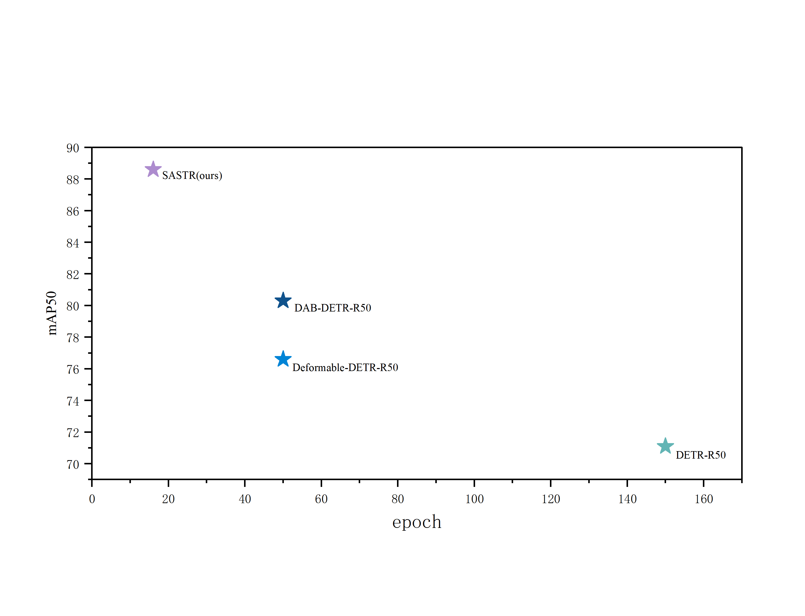
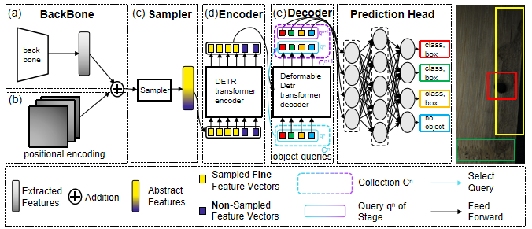

<h1>SASTR </h1>
<h3>Transformer-based defect detection for Bamboo Slice using  Spatial Feature Sampling and Query Selection Mechanisms</h3>

## Abstract
At present, the defect detection of bamboo slice mainly relies on manual work, and this method has low productivity, which cannot meet the development needs of the bamboo industry. Although some scholars have already proposed defect detection schemes for bamboo slice based on image processing technology, these schemes detect fewer types of defects and have poorer practicality. Therefore, we propose a novel bamboo slice defect detection model inspired by the state-of-the-art detection model DETR.Firstly, the original backbone extraction network ResNet is replaced by InternImage designed by stacking DCNv3 convolution as the core, which is capable of extracting semantically richer features. Then after feature extraction and positional embedding, we added a Sampler sampling module to extract fine foreground target feature vectors and a small number of coarse background context feature vectors, which helps in removing redundant feature information and extracting high-semantic information from the image feature mapping. Finally, we add a new optional query recycling module in the middle of the encoder and the decoder for query filtering to improve the performance of the decoder part of the model. In addition, we use data augmentation to extend the dataset and relocate the parameters learned from other publicly available datasets to enhance the detection of bamboo slice defects. The experimental results show that the approach based on spatial feature sampling and query recycling mechanism can improve the model's defect feature extraction and parsing ability and achieved 88.6\% mAP50 on the test dataset, with a detection accuracy better than other mainstream target detection models, such as DETR (62.9\%), Faster RCNN (71.5\%), and RetinaNet (65.1\%), furthermore, the detection of bamboo slice can be realized by using an industrial camera and the model proposed in this paper to further screen out the bamboo slice containing defects, which provides a more reliable and efficient method for bamboo slice processing. This study provides a theoretical reference and scientific basis for bamboo slice defect detection.

## Overview

<h3>The code will be opened soon</h3>